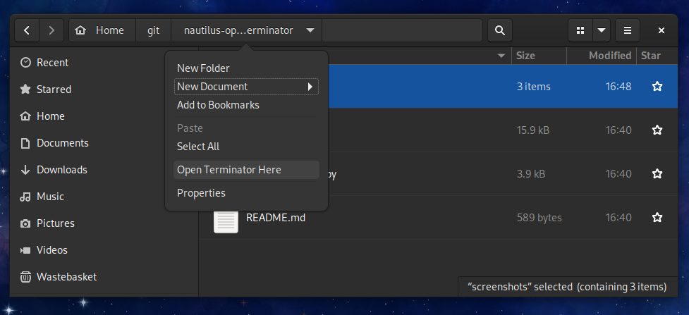
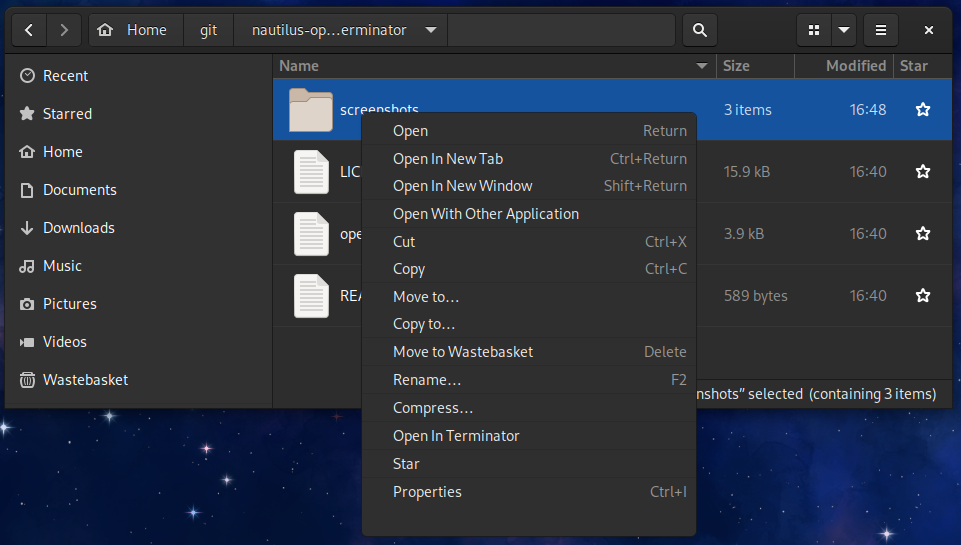

# open-terminator.py

Add an `Open In Terminator` and `Open Terminator Here` to the right-click menu in Nautilus/Gnome Files

## Dependencies

Ensure you have thr nautilus python bindings installed

  - Fedora and derivitives
    
        sudo dnf install nautilus-python

  - Debian and derivitives

        sudo apt-get install python3-nautilus

## Install

Install for your user account:

    mkdir -p ${HOME}/.local/share/nautilus-python/extensions/
    curl -lo ${HOME}/.local/share/nautilus-python/extensions/open-terminator.py https://raw.githubusercontent.com/timhughes/nautilus-open-terminator/master/open-terminator.py
Install system-wide:

    sudo curl -lo /usr/share/nautilus-python/extensions/open-terminator.py  https://raw.githubusercontent.com/timhughes/nautilus-open-terminator/master/open-terminator.py

You may need to ensure all `nautilus` processes are killed 

    pkill nautilus

## Screenshots

